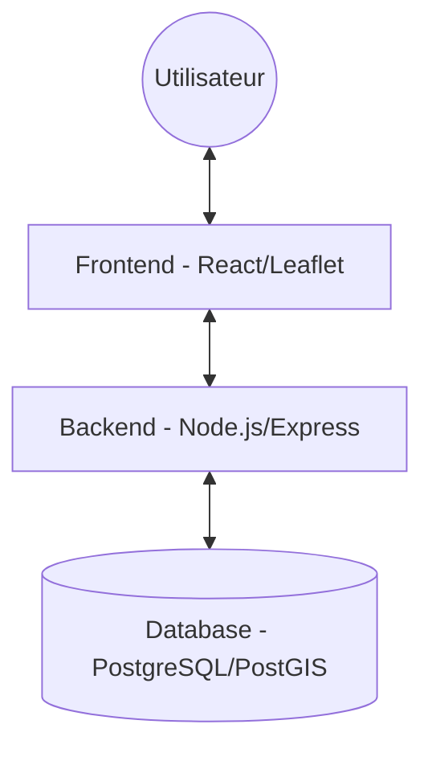

# City Explorer - Carte de France Interactive

## Contexte du Projet
Projet final pour le module "Développement des Composants Métier". Cette application fullstack permet d'explorer les villes françaises de métropole à travers une carte interactive. 
L'utilisateur peut cliquer sur la carte pour définir un point d'origine et obtenir les villes environnantes selon des critères dynamiques (rayon, population, région).

## Objectifs Fonctionnels
- **Carte interactive** : Sélection d'un point par clic géographique.
- **Calcul de distance** : Utilisation de PostGIS (`ST_DistanceSphere`) pour des calculs précis depuis l'origine.
- **Filtrage dynamique** : Nombre de villes, distance maximale, population minimale et filtrage par région.
- **Interactivité bidirectionnelle** : Le survol d'une ville sur la carte la met en évidence dans la liste (en vert) et vice-versa.
- **Cercle de recherche** : Visualisation du rayon de recherche sur la carte.

## Installation et Exécution locale (Docker)

Le projet est entièrement conteneurisé. Pour le lancer sur votre machine :

1. Clonez le dépôt.
2. Ouvrez un terminal à la racine du projet.
3. Exécutez la commande suivante :
   ```bash
   docker compose up -d --build
   ```
4. L'application est alors accessible aux adresses suivantes :
   - **Frontend** : [http://localhost:5173](http://localhost:5173)
   - **API (Backend)** : [http://localhost:5000](http://localhost:5000)

## Choix Techniques et Architecture

### Architecture Globale
L'application suit une architecture client-serveur classique, orchestrée par Docker Compose.



### Stack Technique
- **Frontend** : React.js avec Vite. Utilisation de Leaflet pour la cartographie interactive.
- **Backend** : Node.js avec Express.js. Gestion des routes REST.
- **Base de Données** : PostgreSQL 15 avec l'extension PostGIS pour le traitement spatial des coordonnées géographiques.
- **Outils** : Docker pour la portabilité, Axios pour les appels API.

### Justification des choix
- **PostGIS** : Indispensable pour traiter efficacement plus de 30 000 villes. Les fonctions géospatiales permettent d'effectuer les tris par distance directement au niveau de la base de données, garantissant des performances optimales.
- **Leaflet** : Bibliothèque légère et performante pour l'affichage de cartes OpenStreetMap.
- **Node.js** : Choisi pour sa rapidité de mise en œuvre et sa cohérence de stack avec React (JavaScript/TypeScript). Note : La contrainte initiale Java/C# a été levée par le formateur.

## Documentation de l'API

### Endpoints principaux
- `GET /api/cities/nearby` : Retourne les villes correspondant aux filtres.
  - Paramètres : `lat`, `lng`, `limit`, `maxDistance`, `minPopulation`, `region`.
- `GET /api/cities/regions` : Retourne la liste unique des régions présentes en base.

## Réflexion sur l'expérience (Auto-évaluation)
- **Points forts** : L'interactivité visuelle (cercle de rayon, highlights verts) rend l'expérience utilisateur intuitive. L'architecture Docker facilite grandement le déploiement sur n'importe quel poste.
- **Défis rencontrés** : La gestion de la synchronisation entre les composants (Map et List) a nécessité une gestion d'état centralisée efficace dans `App.jsx`.
- **Modifications d'approche** : Initialement, une approche "snap-to-nearest-city" était envisagée, mais je suis revenu à une origine précise (coordonnées cliquées) pour mieux respecter l'énoncé du TP.

---
Projet réalisé par Vincent Desoeuvre.
